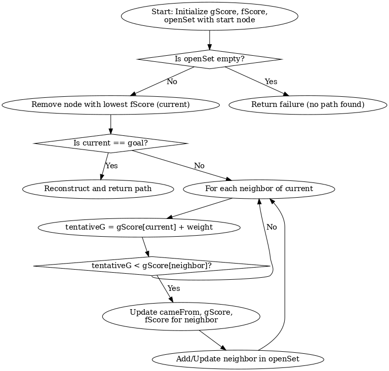

## 1) Algorithm
## A* Search Algorithm

The A* search algorithm combines:

- **Dijkstra’s principle** → minimum distance so far `g(n)`
- **Greedy best-first principle** → estimate to goal `h(n)`

---

### Steps:

1. Initialize an **open set** (priority queue) containing the start node.
2. Set `g(start) = 0` and `f(start) = h(start)` (heuristic only).
3. While the open set is not empty:
    - Pick the node with the lowest `f-score`.
    - If it is the **goal** → reconstruct and return the path.
    - Otherwise, for each neighbor:
        - Calculate `tentative_g = g(current) + distance(current, neighbor)`.
        - If `tentative_g` is better than previously known `g(neighbor)`:
            - Update `g(neighbor)` and `f(neighbor) = g(neighbor) + h(neighbor)`.
            - Add neighbor to the open set.
4. If the open set becomes empty and goal not found → **no path exists**.


**In this project (UG Navigate):**
- Nodes = campus landmarks (e.g., Bank, Library, Cafeteria).
- Edge weights = distance or travel time (can include traffic).
- Heuristic = straight-line (Euclidean) distance between (x, y) coordinates of landmarks.

---

## 2) Flowchart (where to place the image)




---

## 3) Pseudocode

```text
A_STAR(SearchGraph G, Node start, Node goal):
    openSet ← min-priority-queue ordered by fScore
    openSet.insert(start)

    cameFrom ← empty map           // to reconstruct path
    gScore[n] ← +∞ for all nodes n
    fScore[n] ← +∞ for all nodes n

    gScore[start] ← 0
    fScore[start] ← heuristic(start, goal)

    closedSet ← empty set

    while openSet not empty:
        current ← node in openSet with lowest fScore
        if current = goal:
            return RECONSTRUCT_PATH(cameFrom, current)

        remove current from openSet
        add current to closedSet

        for each edge (current → neighbor) in G:
            if neighbor in closedSet: continue

            tentativeG ← gScore[current] + weight(current, neighbor)

            if tentativeG < gScore[neighbor]:
                cameFrom[neighbor] ← current
                gScore[neighbor] ← tentativeG
                fScore[neighbor] ← tentativeG + heuristic(neighbor, goal)

                // reinsert neighbor to refresh its priority
                if neighbor in openSet: openSet.remove(neighbor)
                openSet.insert(neighbor)

    return EMPTY_PATH  // no route found


RECONSTRUCT_PATH(cameFrom, current):
    path ← [current]
    while current in cameFrom:
        current ← cameFrom[current]
        prepend current to path
    return path
