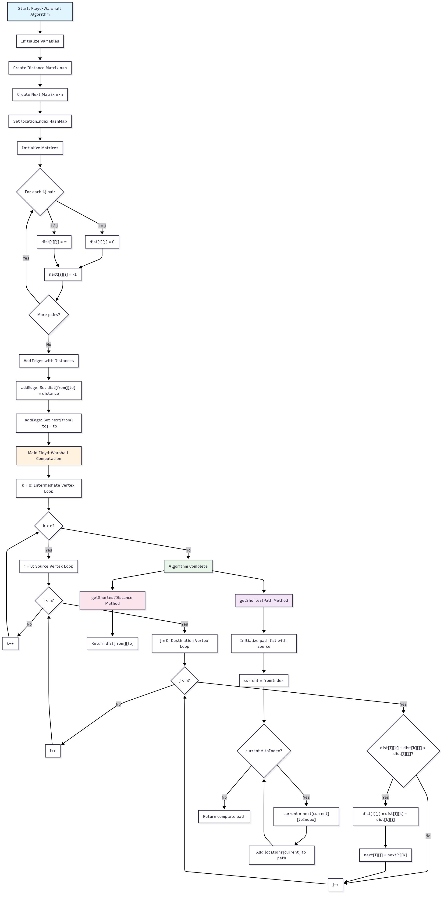

## 1) Algorithm
## Floyd-Warshall Algorithm
Algorithm Explanation

The Floyd-Warshall algorithm is a dynamic programming approach that finds the shortest paths between all pairs of vertices in a weighted graph. For the UG Navigate project, this means we can calculate the shortest distance between any two locations on campus in a single computation.

INPUT: graph - adjacency matrix representing distances between locations

OUTPUT: dist - matrix of shortest distances between all pairs of locations

---

### Steps:

1.Initialize a distance matrix with direct distances between locations

2.For each intermediate location k, check if going through k provides a shorter path

3.Update the distance matrix if a shorter path is found

4.Repeat for all possible intermediate locations

**In this project (UG Navigate):**
- Nodes = campus landmarks (e.g., Bank, Library, Cafeteria).
- Edge weights = distance or travel time (can include traffic).
- Heuristic = straight-line (Euclidean) distance between (x, y) coordinates of landmarks.

---

## 2) Flowchart (where to place the image)




---

## 3) Pseudocode

```text
    BEGIN
        n ← number of vertices in graph
        
        // Initialize distance matrix
        FOR i ← 0 to n-1 DO
            FOR j ← 0 to n-1 DO
                IF i = j THEN
                    dist[i][j] ← 0
                ELSE IF edge exists from i to j THEN
                    dist[i][j] ← weight of edge from i to j
                ELSE
                    dist[i][j] ← INFINITY
                END IF
            END FOR
        END FOR
        
        // Main Floyd-Warshall computation
        FOR k ← 0 to n-1 DO              // Intermediate vertex
            FOR i ← 0 to n-1 DO          // Source vertex
                FOR j ← 0 to n-1 DO      // Destination vertex
                    IF dist[i][k] + dist[k][j] < dist[i][j] THEN
                        dist[i][j] ← dist[i][k] + dist[k][j]
                        next[i][j] ← next[i][k]  // For path reconstruction
                    END IF
                END FOR
            END FOR
        END FOR
        
        RETURN dist
    END